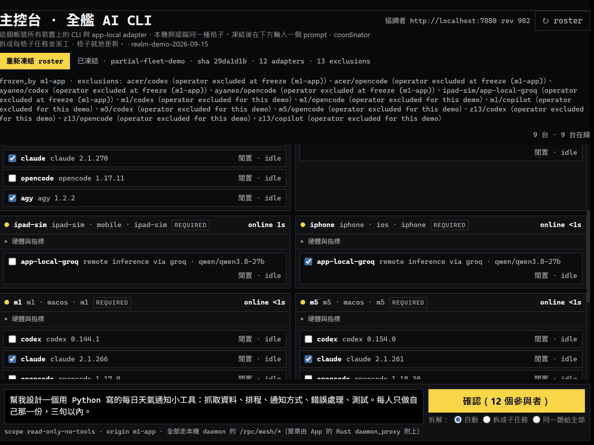

# Spectyn Mesh

> [!IMPORTANT]
> ## 🔧 回廠重造中 · Back in the shop（2026-09）
>
> **這個專案正在從架構層重新設計。** 目前的 coordinator／worker 契約、adapter 層、手機端的做法整個可能推倒重來。下面的 README 描述的是重造前的版本——請當作歷史快照讀，**不要依賴任何介面、指令或資料格式。**
>
> 為什麼：三週的實測（十輪 fan-out、真機＋模擬器）把幾條設計上的縫暴露出來——沒有 coordinator 備援、子任務的角色和語言由 planner 自行決定、receipt 的 nonce 規則和輸出上限互相牴觸——同一時間開源生態長出了值得對照的東西（A2A 協定、Orca、Paperclip、Gas Town）。與其一條一條補，不如對照完再重畫。
>
> 進度公開記在兩個地方：本 repo 的 commit，以及 iThome 鐵人賽的兩個系列——[開發流水帳](https://ithelp.ithome.com.tw/users/20092056/ironman/9330)、[邊做邊補](https://ithelp.ithome.com.tw/users/20092056/ironman/9765)。
>
> **This project is being redesigned from the architecture up.** The coordinator/worker contract, the adapter layer and the phone-side design may all be replaced. Everything below describes the pre-rebuild version — read it as a snapshot, and do not depend on any interface, command or data format. Three weeks of real runs exposed seams (no coordinator failover; subtask roles and language left to the planner; the receipt nonce rule fighting the output cap), and the open-source landscape now has things worth measuring against (A2A, Orca, Paperclip, Gas Town). Progress is logged in this repo's commits and in the two iThome Ironman series linked above.

<p align="center">
  
</p>

<p align="center">
  <strong>A compounding, private AI you run yourself — on a mesh of your own machines.</strong><br>
  <em>一個你自己跑、會越用越懂你的私人 AI mesh。</em>
</p>

<p align="center">
   ·
   ·
   ·
  
</p>

> [!WARNING]
> **🚧 v0.6.0 snapshot, superseded by the rebuild above. Not stable; not recommended for others to depend on.**
> Direction, interfaces, and architecture may still change. This repo is a public, honest look at the
> work in progress. Some subsystems below are solid and tested; others are early or stubbed — each is
> marked explicitly. 方向與介面仍在演進,部分子系統已可用、部分仍在早期,文中均如實標註。

## Preview 🚧

<p align="center">
  
</p>

<p align="center">
  <em>🚧 正在建構中 / Under construction — the iOS console app, running live against a 5-node mesh:<br>
  signed governance flight-recorder, MCP tool exposure, and goal orchestration. Not yet released.</em>
</p>

<p align="center">
  
</p>

<p align="center">
  <em>Recorded 2026-09-14, unedited — the desktop fleet console: one prompt, split by the coordinator into 12 sub-tasks
  across Windows, macOS, iOS and Android; every tile returns its own output and a verified receipt, and the coordinator
  then merges the twelve answers into one 整合輸出 with a contributor tag per section.<br>
  2026-09-14 實錄、未剪輯：主控台打一個 prompt，coordinator 拆成 12 份子任務給 8 台裝置上的 AI CLI 與手機執行端，每格帶回自己的輸出與驗證過的收據，最後再把 12 份答案合成一份整合輸出。
  <a href="demos/06-fleet-console-one-prompt.md">Demo 06 →</a> · <a href="demos/transcripts/2026-09-14-0946-tech-talk-plan.md">逐字稿 / transcript →</a></em>
</p>

---

## What it is

Spectyn Mesh is a personal AI platform you own end to end. Instead of sending your data to someone
else's server, you run a small Rust backend on hardware you control — your desktop, or a cloud Linux
sandbox — and drive it from a phone or a desktop app. Connect a few of your own machines (Windows /
macOS / Linux / Android) over a private [Tailscale](https://tailscale.com) network and they become a
single **mesh**: tasks get decomposed and routed to whichever node is best suited to run them.

Three ideas make it more than a chat wrapper:

- **It is yours.** Capture and conversation data is stored locally, encrypted client-side (age /
  ed25519 / HKDF). The core engine is AGPL and has no paywall — your data never has to leave machines you own.
- **It compounds.** An **owned-memory** layer lets the agent recall and learn from your past usage
  (FTS5-backed, default-on, with a kill switch) so it gets more useful the longer you use it.
- **It can run unattended — safely.** The differentiator: a **governor + flight-recorder** wraps AI
  CLI sessions (codex / claude / agy / opencode) behind a *pre-action gate* you approve, deny, or stop
  from your phone. Long autonomous runs stay reversible and auditable instead of being a black box.

## Why I built it

I wanted a single private AI that I actually use every day — one that remembers context across
sessions, runs across all the machines I own, and that I can let work on its own without giving up
control. The hard, interesting part isn't another chatbot; it's the *plumbing of trust*: client-side
crypto, an HMAC-authed mesh, and a human-in-the-loop governor that makes unattended agent runs safe.

## Architecture

```
   Phone / Desktop app  ──────────────┐
   (approve · deny · stop, from afar)  │
                                       ▼
                          ┌──────────────────────────┐
                          │   spectyn backend (Rust)  │   ← runs on YOUR desktop
                          │                           │     or a cloud Linux sandbox
                          │  ┌─────────────────────┐  │
                          │  │  Governor + Flight-  │  │   apex differentiator:
                          │  │  Recorder (L1)       │  │   pre-action gate + audit log
                          │  └──────────┬──────────┘  │
                          │  ┌──────────▼──────────┐  │
                          │  │ AI-CLI sessions      │  │   codex · claude · agy · opencode
                          │  │ (normalized stream)  │  │   under one governed envelope
                          │  └─────────────────────┘  │
                          │  ┌─────────────────────┐  │
                          │  │ Owned memory (FTS5)  │  │   recall + learn from past use
                          │  │ Encrypted store(age) │  │   client-side crypto at rest
                          │  └─────────────────────┘  │
                          │  ┌─────────────────────┐  │
                          │  │ Cluster brain        │  │   decompose → score peers →
                          │  │ (HMAC-authed)        │  │   route across the mesh
                          │  └──────────┬──────────┘  │
                          └─────────────┼─────────────┘
                                        │ Tailscale mesh (HMAC-authed RPC)
                ┌───────────────────────┼───────────────────────┐
                ▼                       ▼                       ▼
          your desktop            your laptop            a build node
          (Windows)               (macOS)                (Linux / Android)
```

The Rust workspace lives in **`core/`** (the engine, mesh, CLI, and dispatch brain); the cross-platform
desktop/mobile shell is a **Tauri 2 app** in **`app/`** (React + TypeScript front-end, Rust commands).
The wire-protocol types are factored into **`crates/pm-types`** so satellites and third parties can
depend on the protocol without inheriting AGPL copyleft.

## Features (honest status)

Status is drawn from [`docs/FEATURE-MATRIX.md`](docs/FEATURE-MATRIX.md), a read-only ground-truth sweep
of what is genuinely tested vs early. Nothing here is claimed beyond what the code does.

**Solid & tested**
- **Cross-machine dispatch brain** — rule-based task decomposition, capability-scored peer selection,
  parallel fan-out, and deterministic result integration (`spectyn dispatch`). The best-tested
  subsystem in the repo.
- **HMAC-authed mesh RPC** — canonical sign/verify with dual-accept, Tailscale-aware routing.
- **Client-side crypto** — age v1 encrypt/decrypt, ed25519 identity, HKDF subkey derivation, an
  EventKey scheme, and a sealed-vault primitive — all round-trip + tamper tested.
- **Owned memory & skill bank** — encrypted SQLite + FTS5 event store; skill judge / extract / store
  with keyword recall; recall-before-run is wired into the agent loop (default-on, kill-switchable).
- **Life track** — local capture pipeline (text + image → vision → encrypted store), focus-session
  lifecycle, a deterministic daily-coach review with a shame-free / medical-disclaimer lint, and
  cross-platform scheduler generation (launchd / systemd / schtasks).
- **Governed runs (L1)** — `spectyn govern <claude|codex|opencode|agy>` drives an AI CLI under a
  governor + flight-recorder with a real PreToolUse pre-action gate and phone escalation.

**Early / partial (use with eyes open)**
- **Mobile front-ends** — the React page catalog and Android shell exist; native camera / push /
  background-mode capture UI is largely not built yet. There is no separate iOS app repo — all
  "iOS" code lives in the Tauri app under `app/`.
- **At-rest key storage** — real on Linux (Secret Service + `chmod 0600`); macOS / Windows / Android
  native keystores are stubbed. Treat secrets accordingly.
- **Semantic recall** — keyword (FTS5) recall is real; the embedding-similarity leg is deferred to a
  FTS5 fallback.
- **Multi-provider LLM** — 3 providers wired with real HTTP (Groq / Anthropic / Gemini); others are stubs.
- **Onboarding / release / observability** — several orchestration FSMs and the OTEL/metrics layer are
  partial or not yet implemented.

> Honesty note: the `*_wire.rs` "contract" files and their round-trip tests verify serialization, not
> end-to-end behavior — those are never counted as "tested" above.

## Quickstart

Right now the only installer builds from source, so you need a Rust toolchain
([`rustup`](https://rustup.rs)). No admin rights required; install is per-user and idempotent.

```powershell
# Windows (PowerShell) — builds from source, installs to %LOCALAPPDATA%\spectyn-mesh\bin
.\install.ps1                       # or: .\install.ps1 -Prefix C:\path\to\prefix
```

```bash
# macOS / Linux — builds from source, installs to ~/.local/bin
./install.sh                        # or: ./install.sh --prefix /path/to/prefix
```

The installer checks for `cargo`, runs `cargo build --release --bin spectyn`, copies the binary into a
per-user bin dir, creates the data dir, and prints the line to add the bin dir to your `PATH`.

### 30-second hello

```bash
spectyn serve            # start the local daemon (leave running in one terminal)
spectyn food "grilled chicken salad and rice"   # log a meal (another terminal)
spectyn coach review --date "$(date +%F)"        # get today's coach review
```

> Image analysis (`--image lunch.jpg`) and the LLM "tomorrow's one action" line need a provider key;
> without one, capture + review still work — just without vision or LLM suggestions.

### Try a governed run

```bash
# Drive an AI CLI under the governor + flight-recorder, gated by a pre-action approval.
spectyn govern codex "summarize the open TODOs in this repo"
```

## Building from source

```bash
# Core engine + CLI (Rust workspace)
cd core
cargo build --release --bin spectyn         # the `spectyn` CLI
cargo test  --lib                           # run the test suite
cargo clippy --all-targets -- -D warnings   # lint

# Desktop / mobile app (Tauri 2 + React)
cd app
pnpm install
pnpm tauri:dev                              # dev shell
pnpm tauri:build                            # production bundle
```

## Status & honesty

This is a personal project under **active development**, not a finished product. The mesh, dispatch
brain, crypto primitives, owned memory, and the governed-run differentiator work today; the mobile
front-ends, several platform keystores, and parts of the onboarding / release tooling are early or
stubbed. See [`docs/FEATURE-MATRIX.md`](docs/FEATURE-MATRIX.md) for the per-feature ground truth and
[`docs/`](docs) for the broader design. Interfaces may still change before a stable release.

## License

The core engine, mesh, CLI, and desktop app are **AGPL-3.0** (see [`LICENSE`](LICENSE)): your data is
yours, and the core stays free with no paywall. The shared wire-protocol crate
[`crates/pm-types`](crates/pm-types) — the "SDK" layer that satellites and third parties import — stays
permissively **MIT OR Apache-2.0** (see [`LICENSE-MIT`](LICENSE-MIT) / [`LICENSE-APACHE`](LICENSE-APACHE))
so others can depend on the protocol without AGPL copyleft reaching their code.

## Feedback

If you build it and want to share how it went — good or bad — it's very welcome:
open an [issue](https://github.com/markl-a/spectyn-mesh/issues).
