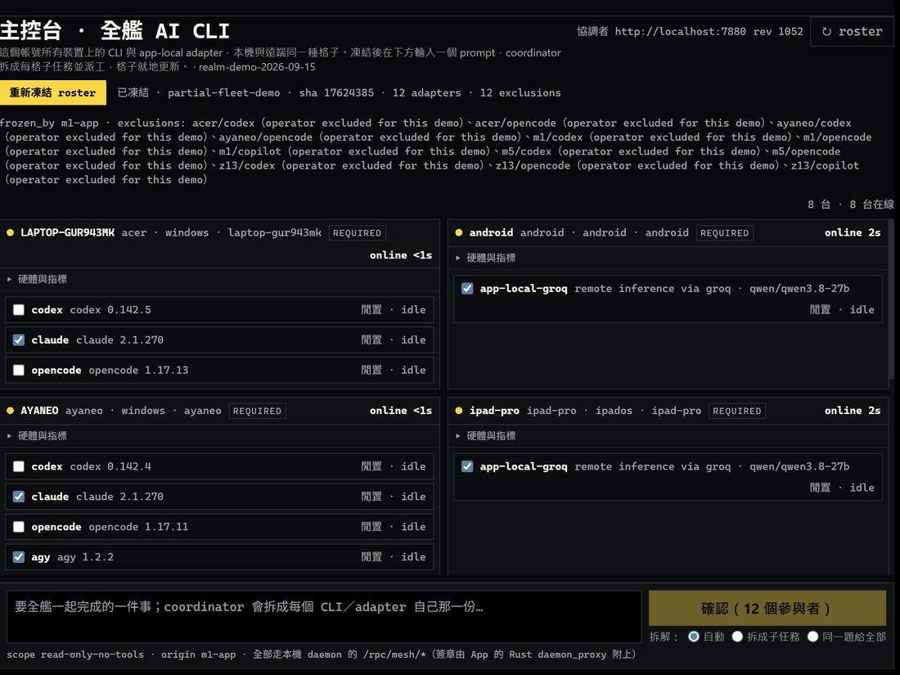

# Demo 06 — One prompt, every AI CLI on every device（一個 prompt，全艦 AI CLI 協同）

**長度（Length）**：85 秒＋180 秒（實錄，非腳本）
**狀態（Status）**：🟢 已錄製 2026-09-14，真機、無剪輯（frames captured from the running Windows App）
**錄影 1（fan-out）**：[`mesh-console-one-prompt-2026-09-14.gif`](mesh-console-one-prompt-2026-09-14.gif) — 一個 prompt → 12 格各自完成
**錄影 2（fan-out ＋ fan-in）**：[`mesh-console-fanin-2026-09-14.gif`](mesh-console-fanin-2026-09-14.gif) — 同樣流程，最後 coordinator 把 12 份答案合成一份「整合輸出」
**逐字稿（每台機器的實際輸出）**：[09:46 技術分享規劃（含整合輸出）](transcripts/2026-09-14-0946-tech-talk-plan.md) · [09:14 天氣通知小工具](transcripts/2026-09-14-0914-weather-tool.md)

  

## 鉤子（Hook）

> "Type one prompt on any device. The coordinator splits it into one sub-task per AI CLI across the whole fleet — Windows, macOS, iOS, Android — and every tile comes back with its own answer and a verified receipt."
>
> 在任一台裝置打一個 prompt，coordinator 拆成每個 AI CLI 自己那一份，Windows／macOS／iOS／Android 一起跑，每格帶回自己的答案與驗證過的收據。

## 畫面上有什麼（Cast / setup）

The recording is the desktop **主控台（fleet console）** of the Windows App on the coordinator machine. Every device the account owns is a card; every AI CLI or app-local adapter on it is a row.

| Device | Platform | Adapters in this run |
|---|---|---|
| z13 (coordinator) | Windows | claude, agy |
| ayaneo | Windows | claude, agy |
| acer laptop | Windows | claude |
| m1 | macOS | claude, agy |
| m5 | macOS | claude, agy |
| iphone | iOS | app-local (Groq, BYOK) |
| ipad-pro | iPadOS | app-local (Groq, BYOK) |
| android tablet | Android | app-local (Groq, BYOK) |

12 participants on 8 devices. `codex`, `opencode` and `copilot` were deliberately unticked at freeze time and appear as **exclusions** in the sealed manifest (`partial-fleet-demo`), which is the honest way the contract records "present but not used".

## 發生了什麼（What the 85 s show）

| 時間 | 畫面 |
|---|---|
| 0:00 | Roster frozen: sealed manifest (sha shown), 12 adapters, 13 exclusions listed by name and reason. |
| 0:03 | Prompt typed at the bottom: *幫我設計一個用 Python 寫的每日天氣通知小工具：抓取資料、排程、通知方式、錯誤處理、測試。每人只做自己那一份，三句以內。* |
| 0:05 | Confirmation dialog: the exact prompt, `prompt_sha256`, the 12 participants, `participants_sha256`, manifest sha — what is sent is what you see. |
| 0:08 | `送出 fanout`. The coordinator's planner (`groq-free`) splits the prompt into **12 distinct sub-tasks** — data fetch, scheduling, notification, error handling, logging, tests, CI… one per adapter. |
| 0:10–0:45 | Tiles flip 閒置 → 執行中 → 完成 as each CLI / phone finishes. Each tile shows **its own sub-task**, **its own output**, the challenge nonce it had to echo, and `receipt ✓ completed`. |
| 0:45–1:25 | Scroll through all eight device cards: Windows CLIs, macOS CLIs, and the iPhone / iPad / Android app-local rows that ran inference through the phone's own Groq key. |

Coordinator-side result for this exact task (`f9545be7`): **state `completed`, 12 / 12 attempts completed with verified receipts, 12 distinct sub-tasks, planner `groq-free`.**

## 整合輸出（fan-in）— 12 份答案合成一份

  

Fan-out alone leaves you with twelve separate answers. In the second recording the coordinator, once every attempt has completed **with a verified receipt**, runs the same planner chain again as an *integrator*: it is given the operator prompt plus each attempt's sub-task and answer, and returns one organized answer in the request's language, tagging every section with the contributor. It appears in the task bar as **整合輸出 · 由 agent:groq-free 合成**, with a copy button. (The phone app does the same merge locally with its own key, labelled as non-receipt.)

Prompt for this run:

> 幫我規劃一場 20 分鐘的「AI 多裝置協同」技術分享：主題定位、投影片大綱、現場 demo 腳本、可能被問的問題與回答、時間分配。每人只做自己那一份，三句以內。

The integrated answer the coordinator produced (verbatim, task `92e41897`, 12/12 verified, merged by `groq-free`):

> **主題定位與目標受眾** [acer/claude]  
> 本次分享聚焦於如何把 AI 編程代理實際嵌入從需求拆解、寫碼到程式碼審查的日常開發流程，以可複製的操作示範取代概念介紹。目標受眾是具備 1‑3 年實務經驗、希望提升交付效率、但尚未將 AI 工具納入固定工作流程的軟體工程師。
> 
> **投影片大綱與章節要點** [android/app-local-groq] + [ayaneo/claude]  
> | 章節 | 要點（一句概述） |
> |------|-------------------|
> | 章節一：背景與痛點 | 簡述多裝置 AI 協同的市場需求與現有工作流程的瓶頸。 |
> | 章節二：核心架構與協同模型 | 解析邊緣計算 + 雲端協同、P2P 自動發現與安全通道的設計。 |
> | 章節三：技術實作與工具 | 介紹模組化雲端架構、部署自動化與多層級安全加密。 |
> | 章節四：核心功能 Live Demo | 現場演示即時資料同步、跨裝置 AI 代理呼叫與結果回饋。 |
> | 章節五：技術亮點與效益分析 | 彙總效能提升、成本降低與業務擴展的具體數據。 |
> | 章節六：結語與行動呼籲 | 提供聯繫方式、入門方案與下一步合作建議。 |
> 
> **視覺風格與配色方案** [ayaneo/agy]  
> - **視覺風格**：現代科技極簡風，專業、清晰、高資訊密度但低認知負擔。  
> - **配色**：主色深海藍 `#0F172A`（標題、重要文字），背景霧灰白 `#F8FAFC` + 卡片白 `#FFFFFF`，強調色電光青 `#0284C7`（亦可使用活力橘 `#F97316`），次要文字石板灰 `#64748B`。  
> - **三個關鍵視覺要素**  
>   1. **模組化卡片結構**：資訊以帶微邊框/淺陰影卡片呈現，留白分組。  
>   2. **排版層級與留白**：字級、字重、行距明確，大面積留白聚焦視覺焦點。  
>   3. **統一幾何圖標與精簡圖表**：線條粗細一致的向量圖標，圖表僅保留關鍵數據與標籤。
> 
> **現場 Demo 腳本與設定** [m1/agy] + [m1/claude]  
> *步驟一：情境鋪陳與初始狀態展示* – 快速展示未處理的原始資料或系統畫面，說明本次要解決的核心痛點。  
> *步驟二：核心功能即時觸發與互動* – 現場觸發 AI 代理流程，讓觀眾即時看到跨裝置同步與回應。  
> *步驟三：成果驗證與效益總結* – 顯示生成的高價值輸出與視覺化對比，導入 Q&A。  
> 
> **Demo 必要設定**  
> 1. **環境變數 / API 金鑰**：在 `.env` 中設定 `API_KEY`、`API_BASE_URL` 等憑證。  
> 2. **執行環境參數**：於啟動指令或 `config.json` 設定 `PORT`、`ENVIRONMENT=demo`，避免與正式環境衝突。
> 
> **可能被問的問題與簡短回答** [m5/agy]（如需更詳細備用說明，可參考 m5/claude 的模板）  
> 1. **核心功能與解決的痛點是什麼？** – 透過自動化與智慧化流程，大幅降低人工操作成本並提升處理效率。  
> 2. **資料安全與隱私如何保障？** – 全部傳輸與儲存採用業界標準加密，並實施嚴格權限控管。  
> 3. **如何與現有系統或第三方服務整合？** – 提供標準化 RESTful API 與模組化介面，支援彈性串接。  
> 4. **遇到錯誤或異常時的除錯方式？** – 系統內建即時監控與結構化日誌，可快速追蹤根因並發出警報。  
> 5. **未來擴充性如何？** – 採用水平擴展設計，能依負載動態調配資源，支援高併發與業務成長。
> 
> **時間分配表** [z13/agy]  
> 
> | 項目 | 內容說明 | 預計時間 |
> |------|----------|----------|
> | 章節一：開場與背景介紹 | 專案背景、核心痛點、展示目標 | 2 分鐘 |
> | 章節二：核心架構與設計理念 | 系統架構、技術選型、關鍵流程 | 4 分鐘 |
> | 章節三：實機 Demo 展示 | Live Demo 核心功能操作 | 8 分鐘 |
> | 章節四：技術亮點與效益分析 | 技術突破、效能提升、應用價值 | 3 分鐘 |
> | 章節五：結語與問答 (Q&A) | 總結與現場提問 | 3 分鐘 |
> **合計** |  | **20 分鐘** |
> 
> **結語與行動呼籲** [z13/claude]  
> 立即行動，讓 AI 多裝置協同的效能從此刻開始落地。  
> 
> ---  
> *如有章節內容需微調（例如主題具體為「AI 多裝置協同」），請告知，我將快速替換相應文字。*

Every one of the twelve underlying answers — device, adapter, sub-task, receipt kind, full text — is in the [transcript](transcripts/2026-09-14-0946-tech-talk-plan.md). In this run the iPhone had gone offline between runs, so the twelfth executor was the iPad simulator on m5 (`ipad-sim/app-local-groq`); the first recording's transcript has the iPhone.

## 為什麼這是旗艦（Why it matters）

- **One input, whole fleet.** The prompt was typed once. No SSH, no per-machine terminals, no copy-paste between devices.
- **Real decomposition, not broadcast.** The planner gave every adapter a different job; the tiles prove it.
- **Phones are executors, not just remotes.** iPhone, iPad and Android each pulled their sub-task and ran it with a device-local API key (BYOK); their receipts are `app-local`, signed and verified like the desktop ones.
- **Fan-in, not just fan-out.** The twelve parts come back as one answer, produced by the same chain that split the work, with provenance per section — and only after every receipt verified.
- **Honest by construction.** Exclusions are named with a reason; the manifest and the fanout body are hashed and shown before sending; a task only reads 全部完成 when every attempt completed *and* its receipt verified.

## 錄製方式（How it was captured）

Frames were captured every 0.7 s from the live App window (Windows `PrintWindow`), the left navigation and OS chrome were cropped, unchanged frames were dropped, and the result was written as a GIF. No cuts, no re-ordering. Device names and tailnet addresses are real; the cluster secret never appears on screen.
